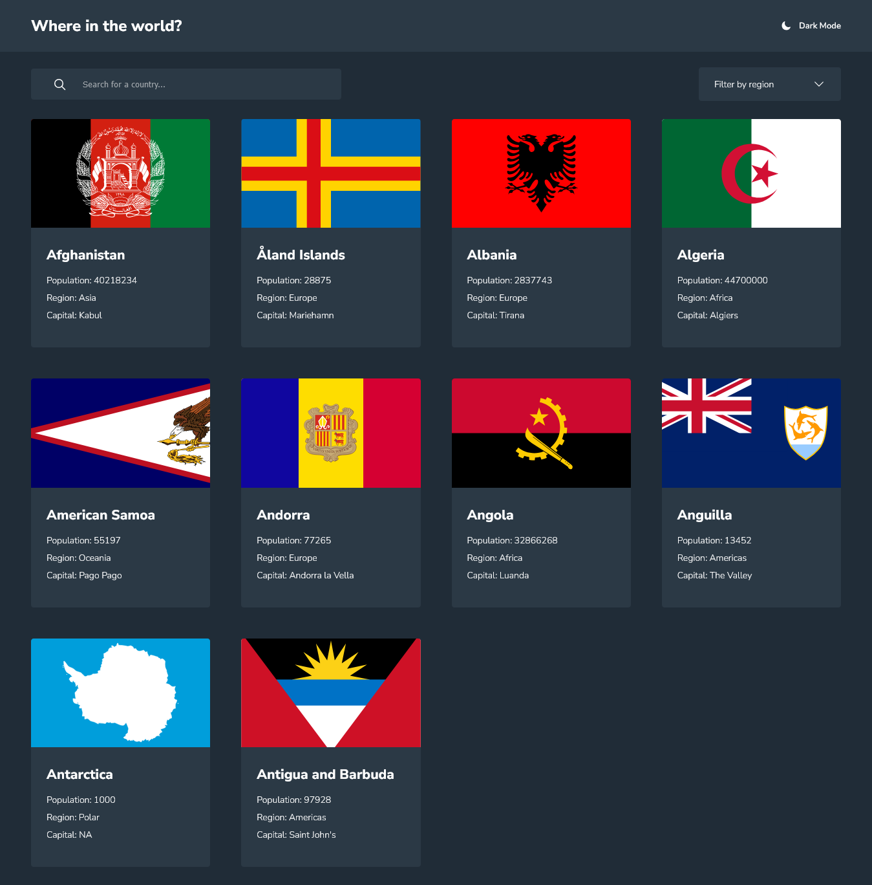

# Frontend Mentor - REST Countries API with color theme switcher solution

Esta es una solución para el [REST Countries API with color theme switcher challenge on Frontend Mentor](https://www.frontendmentor.io/challenges/rest-countries-api-with-color-theme-switcher-5cacc469fec04111f7b848ca). Los retos de Frontend Mentor te ayudan a mejorar tus habilidades de programación construyendo proyectos realistas.

## Visión general

### El reto

Los usuarios deben poder:

- Ver todos los países de la API en la página de inicio
- Buscar un país utilizando un campo `input
- Filtrar los países por región
- Hacer clic en un país para ver información más detallada en una página aparte

### Captura de pantalla

### Enlaces

- URL de la solución: [Añada aquí la URL de la solución](https://your-solution-url.com)
- URL del sitio en vivo: [https://where-in-the-world-gp.vercel.app/](https://where-in-the-world-gp.vercel.app/)

## Mi proceso

### Construido con

- Semantic HTML5 markup
- CSS custom properties
- Flexbox
- CSS Grid
- Mobile-first workflow
- [Next.js](https://nextjs.org/) - React framework

### Lo que aprendí

Desarrollando este proyecto puse en práctica las características de Next.js como la optimización de fuentes e imágenes, la creación de layouts y páginas y la navegación entre páginas.

### Recursos útiles

- [Documentación de Next.js](https://nextjs.org/docs) - Me sirvió de mucha ayuda para orientarme sobre las características que usé del framework.
- [Tutorial Next.js 14](https://www.youtube.com/watch?v=jMy4pVZMyLM) - Este es un tutorial muy bueno de @midudev que me ayudó a profundizar más en Next.js a medida que iba desarrollando el proyecto.

### Autor

- Sitio web - [Pedro Guzmán](https://guzmanpdro.vercel.app/)
- Frontend Mentor - [@guzmanpdro](https://www.frontendmentor.io/profile/guzmanpdro)
- X - [@guzmanpdro](https://www.twitter.com/guzmanpdro)
